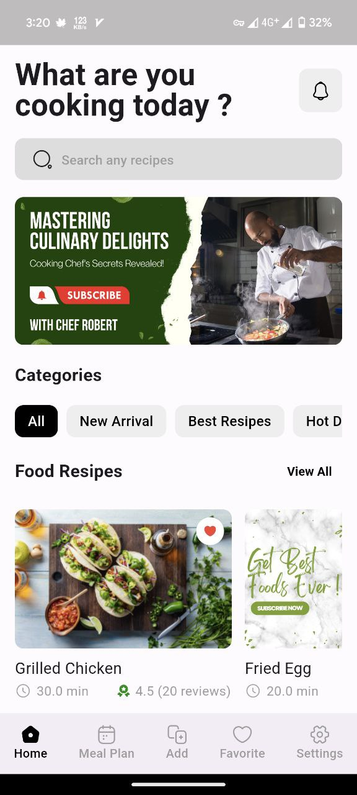

# FOOD RECIPES APP NSBM  🌱

[](https://flutter.dev/)

[](https://opensource.org/licenses/MIT)

Discover delicious and healthy recipes with Green Foodie, your personal recipe companion!

**✨ Features**

* **Explore:** Browse a vast collection of mouthwatering recipes, neatly organized into categories.
* **Search:** Find your perfect dish using our intuitive search bar and handy filters.
* **Plan:** Create weekly meal plans with ease, saving your favorite recipes for later.
* **Shop:** Generate shopping lists directly based on your chosen recipes.
* **Share:** Impress your friends and family by sharing your culinary discoveries.
* **Personalize:**  Fine-tune your experience with custom dietary preferences.

**Screenshots**

* **Home Screen**


[]
 
* **Recipe Detail**
[]
* **Meal Planner**
[]


**Usage**

*    Use the navigation bar to explore different sections of the app.
*    Search for recipes by keywords, ingredients, or categories.
*    Save your favorite recipes for easy access.
*    Plan your week with the meal planner.
*    Create shopping lists to streamline your grocery trips.

**Contributing**

We welcome contributions from the community! Feel free to:

*    Submit bugs and feature requests through the Issue Tracker.
*    Fork the repository and submit pull requests.
*    Review code and provide feedback.

**License**

    Green Foodie is distributed under the MIT License.  See LICENSE for more information.

**Contact**

* Feel free to reach out for any questions or feedback : PraveenKavindu177777@gmail.com

* Show your support ⭐️  If you find Green Foodie useful, please consider starring the repository!

## Getting Started

**Prerequisites**

* Flutter SDK (See installation instructions: [https://flutter.dev/docs/get-started/install](https://flutter.dev/docs/get-started/install))
* An IDE with Flutter support (VS Code or Android Studio recommended)

**Installation**

1. Clone this repository:
   ```bash
   git clone [https://github.com/ZERO-DAWN-X/food_recipe_app_nsbm.git]

2. Install dependencies:
   ```bash
   flutter pub get

3. Run the app:
   ```bash
   flutter run

# Hi i'm PRAVEEN KAVINDU

[](https://your-portfolio-website.com) 
[](https://www.linkedin.com/in/your-linkedin-profile)

**Passionate Software Engineer student at Plymouth University, driven by a love for coding, design, and technology.**

**🛠 Skills:**

* **Coding:** Java, HTML, C#, Flutter, React, Next.js
* **Web Development:** Frontend, Backend 
* **App Development:** Flutter (Cross-platform) 
* **Game Development:** (Specify engines/frameworks if applicable)
* **Graphic Design & UI/UX**


**👩‍💻 I'm currently working on...**
*  *INFINITE DEAD-LOOP:* (Unity Based Game)

**🧠 I'm currently learning...**
*  *AI Language*
*  *Figma Design*

**👯‍♀️ I'm looking to collaborate on...**
* Open-source projects related to (Gemini AI)
* Game development or app development endeavors 

**🤔 I'm looking for help with...**
*  *Mentorship in Plymouth Uni*
*  *Advice on refining my Flutter Framework*

**💬 Ask me about...**
* Web development, Flutter, UI/UX, or my experience at Plymouth University

**📫 How to reach me...**
* praveenkavindu177777@gmail.com

**😄 Pronouns:** PRO

**⚡️ Fun fact:** I'm an avid [hobby or interest outside of tech]! 


